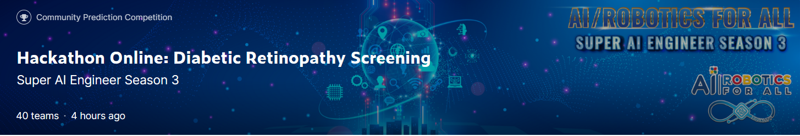
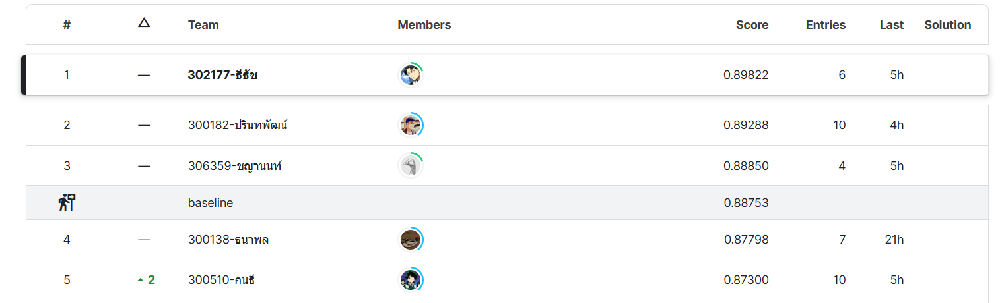

# superai3-Diabetic_Retinopathy_Screening
"Diabetic Retinopathy Screening is a part of the Super AI Engineer Season 3 Online Hackathon. The objective of this hackathon is to solve an image classification problem related to diabetic retinopathy. The problem involves identifying two classes and developing an algorithm to screen for the disease.

My solution for the Diabetic Retinopathy Screening Hackathon uses the state-of-the-art model Eva02, as well as test time augmentation and augmentation techniques on the training dataset. I am proud to say that my notebook achieved 1st place out of 40 participating teams.

LB score 0.90272
PB score 0.89822
